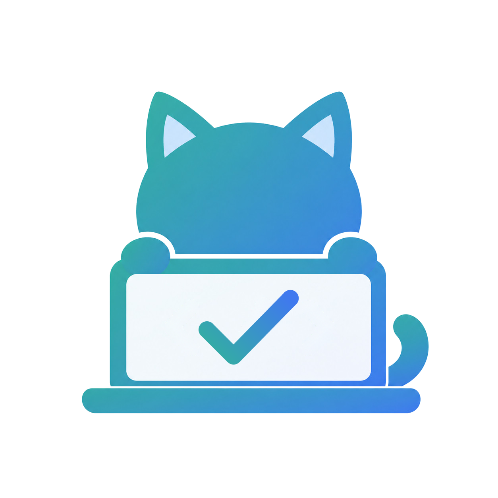
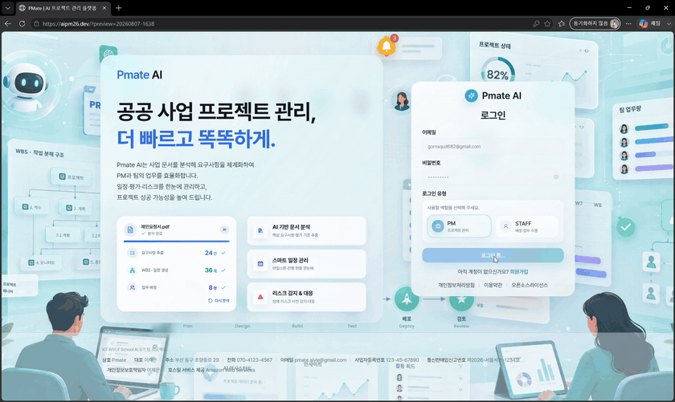
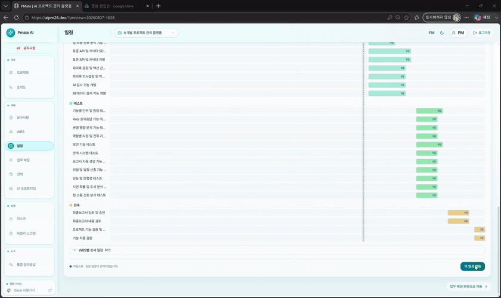
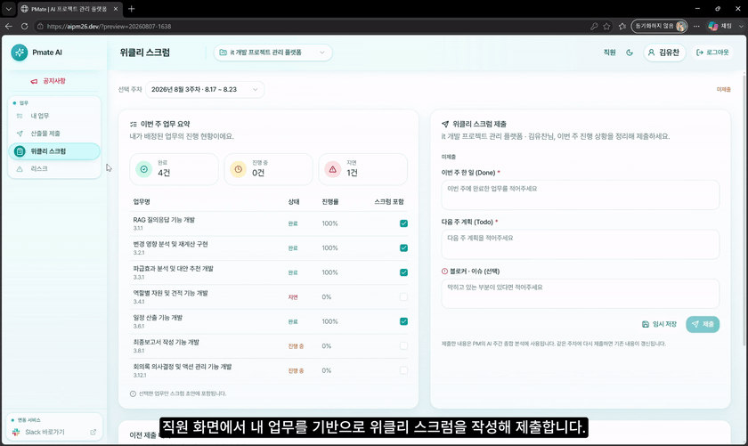
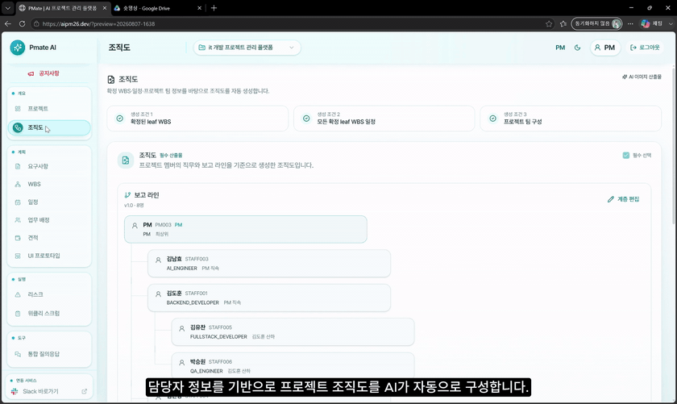

<p align="center">
  
</p>

<h1 align="center">PMate Frontend</h1>

<p align="center">
  AI 기반 IT 프로젝트 관리 플랫폼 PMate의 Web Frontend
</p>

<p align="center">
  <a href="https://aipm26.dev">서비스 바로가기</a>
  ·
  <a href="https://github.com/Aivle-26">Aivle-26 Organization</a>
</p>

---

## Overview

PMate Frontend는 프로젝트 계획을 세우는 **PM**과 배정된 업무를 수행하는 **STAFF**를 위한 역할별 작업 공간입니다. 흩어진 문서와 운영 신호를 반복해서 취합하는 대신, 초기 문서에서 계획·배정·실행·리스크·보고까지 이어지는 검토 흐름을 제공합니다. 문서에서 추출된 요구사항부터 WBS, 일정, 담당자, 견적과 산출물까지 프로젝트 정보를 한 흐름에서 검토하고 확정할 수 있도록 구성했습니다.

AI 결과를 브라우저에서 직접 생성하지 않습니다. Frontend는 Spring Boot Backend의 REST API에 요청을 보내고, 반환된 제안을 사람이 검토·수정·확정할 수 있는 UI로 표현합니다.

## Demo

### 프로젝트 생성과 계획 시작

PM이 프로젝트 기본 정보와 문서를 등록하면 요구사항 분석 화면으로 이어집니다.

<p align="center">
  
</p>

### 팀 구성과 업무 배정

프로젝트 멤버를 구성하고 역할·기술·숙련도·경력·가용시간 기반 추천을 확인한 뒤, 말단 WBS별 담당자를 조정해 저장합니다.

<p align="center">
  
</p>

### STAFF 제출에서 PM 검토까지

STAFF가 자신의 업무를 기준으로 위클리 스크럼을 작성하면 PM 화면에서 팀 제출 현황을 이어서 확인할 수 있습니다.

<p align="center">
  
</p>

### 조직도 생성과 편집

담당자 정보를 바탕으로 만든 계층 구조를 검토·수정하고 최종 조직도를 확인합니다.

<p align="center">
  
</p>

## Key Features

### PM Workspace

- **프로젝트와 문서** — 프로젝트 초안 생성·삭제, RFP/참고 문서 업로드·조회·삭제, PDF 근거 구간 확인
- **요구사항** — 문서 분석 요청, AI 제안과 최종 편집본 비교, 항목 추가·수정·정렬, 전체 확정, 변경 후보 검토·적용
- **WBS와 일정** — 비동기 WBS 생성 상태 폴링, 계층형 작업 검토·확정, 예상/권장/보수 일정 비교 및 최종 일정 저장
- **팀 구성과 업무 배정** — 프로젝트 멤버 구성, 역할·기술·숙련도·경력·가용시간 기반 담당자 추천, 말단 WBS별 담당자 조정·일괄 저장, 팀 워크로드 확인
- **견적과 산출물** — KOSA 기반 공수·비용 계산 및 저장, UI 목업 필요성 분석·생성·미리보기·다운로드
- **조직도** — 확정 WBS·일정·프로젝트 멤버를 바탕으로 생성하고, Drag & Drop으로 보고 체계를 편집한 뒤 버전 단위로 저장·다운로드
- **리스크** — Slack 커뮤니케이션 위험 신호와 근거 메시지 확인, 요구사항 변경을 확정 WBS와 대조한 영향 업무·팀원·추가 작업일 검토 및 PM 보정
- **리포트와 Assistant** — 팀원 위클리 스크럼 취합, 기준문서 검토, 차주 업무 추천, PM 승인·수정·거절을 거친 최종 보고서 확정, 출처가 포함된 프로젝트 통합 질의응답

### STAFF Workspace

- 배정된 업무를 Kanban으로 확인하고 `TODO`·`IN_PROGRESS`·`COMPLETED` 진행 상태 갱신
- 프로젝트 문서함을 이용한 산출물 제출·조회·다운로드
- 주차별 업무 요약, 계획, 이슈를 작성하고 위클리 스크럼 제출
- PM 공지와 제출 요청 확인

## Application Flow

```text
PM
└─ 프로젝트 생성
   └─ 문서 업로드 · 요구사항 분석
      └─ 요구사항 검토 · 확정
         └─ WBS 생성 · 편집 · 확정
            └─ 일정 생성 · 비교 · 확정
               └─ 팀 구성 · 담당자 추천 · 배정 저장
                  ├─ 견적 · UI 목업
                  └─ 조직도 · 리스크 · 위클리 스크럼 · 통합 질의응답

STAFF
└─ 배정 업무 확인 · 진행률 갱신
   ├─ 산출물 제출
   └─ 위클리 스크럼 작성
```

프로젝트 카드는 Backend에 저장된 요구사항·WBS·일정·배정·견적·UI 목업 상태를 뒤 단계부터 확인해 다음 작업 화면을 안내합니다.

## API Integration

```text
PM / STAFF Browser
        │
        │ Bearer Token + JSON / Multipart / Blob
        ▼
PMate Frontend
        │
        │ /api
        ▼
Spring Boot Backend
        ├─ 인증·권한과 프로젝트 데이터
        ├─ 문서·산출물 저장
        └─ AI Server 호출과 결과 영속화
```

- `src/app/api/projectRepository.ts`가 인증, 프로젝트, 문서, 요구사항, WBS, 일정, 배정, 견적, 위클리 스크럼과 이미지 산출물 API를 공통 처리합니다.
- 인증 세션은 `aipm.authSession`에 저장하며, 보호 API에 Access Token을 전달합니다. `401` 응답 시 Refresh Token으로 한 번 갱신하고, 재실패하면 세션을 지운 뒤 로그인 화면으로 전환합니다.
- 통합 질의응답과 리스크 기능은 별도 API client에서 Backend endpoint를 호출합니다. Frontend가 AI Server를 직접 호출하지는 않습니다.
- 조직도와 UI 목업은 인증된 Blob 응답으로 미리보기와 다운로드를 제공하므로 S3 URL이나 저장소 자격 증명을 브라우저에 노출하지 않습니다.

### API와 예시 데이터의 경계

| 구분 | 현재 구현 |
| --- | --- |
| Backend API 연동 | 인증, 프로젝트, 문서, 요구사항, WBS, 일정, 멤버/업무 배정, 견적, 조직도, UI 목업, 공지, 위클리 스크럼, 통합 질의응답, 주요 리스크 분석 |
| 명시적 예시 데이터 폴백 | STAFF 업무·요구사항·WBS·위클리 스크럼·산출물은 서버 결과가 비어 있거나 조회에 실패하면 화면에 `예시 데이터`임을 표시하고 seed data를 보여줍니다. |
| Local UI 상태 | STAFF 업무 상세의 체크리스트·댓글·검토 요청과 STAFF 리스크 목록 등 일부 보조 상호작용은 아직 `demoRepository` 또는 component state를 사용합니다. |

기본 `/` 작업 공간의 component 이름은 코드상 `DemoApplication`이지만, 위 핵심 PM 계획 흐름은 실제 Backend API를 사용합니다. `/real`은 프로젝트 목록과 문서·요구사항, 조직도·UI 목업처럼 서버 영속 데이터만 좁게 확인하기 위한 별도 경로입니다.

## Routing & Deployment

- `src/main.tsx`가 pathname을 기준으로 기본 작업 공간과 `/real` 작업 공간을 선택합니다.
- 기본 작업 공간의 PM/STAFF 메뉴 전환은 sidebar state로 관리합니다. `/real/projects/:projectId/data`는 History API로 선택한 프로젝트를 URL에 반영합니다.
- 개발 환경에서는 Vite가 `/api`를 `VITE_API_PROXY_TARGET` 또는 기본 `http://localhost:8080`으로 proxy합니다.
- `VITE_AUTH_API`를 지정하면 공통 API client가 해당 Backend 주소를 직접 사용하며, 통합 질의응답·리스크 client는 필요 시 `VITE_COMMUNICATION_RISK_API`를 사용합니다.
- `vercel.json`은 `/api/*` 요청을 Backend upstream으로 전달하고, 나머지 경로를 `index.html`로 rewrite합니다. 서비스 메타데이터의 기준 도메인은 [`aipm26.dev`](https://aipm26.dev)입니다.

## Tech Stack

| 영역 | 기술 |
| --- | --- |
| Core | React 18, TypeScript/TSX, Vite 6 |
| Styling & UI | Tailwind CSS 4, Radix UI, MUI, Emotion, Lucide React |
| Interaction | React DnD, Motion, Sonner |
| Data Presentation | Recharts, PDF.js |
| Test | Playwright E2E |
| Deployment | Vercel SPA Rewrite & API Proxy |

## Getting Started

```bash
npm ci
npm run dev
```

기본 개발 주소는 `http://127.0.0.1:5173`이며, Backend 기본 proxy 대상은 `http://localhost:8080`입니다.

```bash
npm run build
npm run test:e2e
```

## Project Structure

```text
src/
├─ app/
│  ├─ api/                 # Backend REST client와 인증 토큰 helper
│  ├─ auth/                # 세션 관련 model과 helper
│  ├─ components/
│  │  ├─ auth/             # 로그인·회원가입
│  │  ├─ layout/           # Sidebar, TopBar, 프로젝트 범위 선택
│  │  ├─ pm/               # PM 계획·운영 화면
│  │  ├─ staff/            # STAFF 업무·제출 화면
│  │  ├─ common/           # 산출물·리스크·진행 현황 공통 UI
│  │  └─ ui/               # 재사용 UI primitive
│  ├─ projects/            # 프로젝트 mapping과 계획 단계 판정
│  ├─ real/                # /real 서버 데이터 확인 경로
│  ├─ state/               # 화면 공유 상태와 명시적 fallback store
│  └─ App.tsx              # 역할별 workspace 조합
├─ main.tsx                # pathname 기반 application mode 선택
└─ styles/                 # 전역 theme와 Tailwind style

tests/e2e/                 # API contract와 사용자 흐름 E2E 검증
vercel.json                # SPA 및 /api rewrite
```

## Team & Related Repositories

- [PMate Backend](https://github.com/Aivle-26/backend-repo) — 인증, 프로젝트 데이터와 AI 연동을 담당하는 Spring Boot API Server
- [PMate AI Server](https://github.com/Aivle-26/ai-server) — 요구사항·계획·산출물·리스크 분석을 담당하는 AI Server
- [Aivle-26 Organization](https://github.com/Aivle-26) — 팀 소개와 전체 프로젝트 Repository
